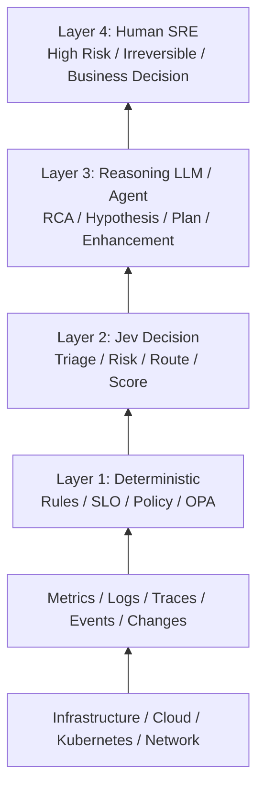

# インフラ事業にどのようにAIを活用していけるか？
## ― LLM × TypeSafe AI Jev による「AI-SRE Control Plane」構想 ―

**作成日:** 2026-09-22  
**テーマ:** インフラ構築・運用事業を、AIを前提とした次世代SRE事業へどのように進化させるか

---

## 1. エグゼクティブサマリー

インフラ構築・運用事業におけるAI活用を考えるとき、単に「LLMにログを読ませる」「障害時にチャットで質問する」といった補助的利用に留める必要はない。

LLMの推論能力、ツール利用能力、コード生成能力は急速に向上しており、2026年現在、Google CloudもGemini Cloud Assistを通じて、ログ・メトリクス・トレース・構成・コードを横断したRoot Cause Analysis（RCA）、アラート起点の自律調査、コスト最適化、MCP経由の運用エージェントなどを現実のクラウド運用へ組み込み始めている。

一方で、インフラ運用で発生する全ての判断を高性能LLMに任せる設計は、必ずしも合理的ではない。

日々の運用では、

- このアラートは無視してよいか
- 既存Incidentの重複か
- どのRunbookを選ぶべきか
- Restartしてよいか
- Rollback候補か
- HumanへEscalateすべきか
- もう少しObserveすべきか

といった「高度な長時間推論までは必要ないが、単純なif文にも落としにくい判断」が大量に発生する。

ここで大きなヒントになるのが、TypeSafe AIが2026年9月に公開した**System One Model「Jev」**である。

Jevは、文章生成を目的とするLLMとは異なり、**「unstructured state in → typed probabilistic decisions out」**、すなわち状況を入力し、型付きの判断と確率・信頼度を高速に返すことへ特化している。TypeSafeは、Jevを「smart if-statements」「AI-powered workflows」に向くモデルとして位置付けている。

この性質をインフラ運用へ持ち込むことで、次のような階層型AI-SREが考えられる。

1. **Deterministic Layer**  
   ルール、SLO、Prometheus、Policy as Codeなど、明確な条件を機械的に処理する。

2. **Jev Decision Layer**  
   高頻度に発生する曖昧な運用判断を、高速・低コストに処理する。

3. **Reasoning LLM / Agent Layer**  
   未知障害、複数仮説の検証、RCA、改善計画など、深い推論を担当する。

4. **Human SRE Layer**  
   高リスク、不可逆、大きなBlast Radius、ビジネス判断を伴う処置について最終責任を持つ。

この考え方は、AIに人間を丸ごと置き換えさせる構想ではない。

むしろ、**「判断の難易度・リスク・可逆性に応じて、最も適切な知能へ処理をルーティングする」**ことで、SREの能力を組織全体として拡張する考え方である。

インフラ構築・運用を事業とする企業にとって、この仕組みは単なる省人化ではなく、

- 24時間365日の一次調査能力
- MTTR短縮
- Alert Noise削減
- 運用品質の標準化
- ベテランSREの知識の組織資産化
- 1人のエンジニアが管理できるシステム数の拡大
- 自動復旧・自動改善サービスの提供
- 高付加価値なManaged SREサービスへの転換

につながる可能性がある。

したがって、AI-SREは「将来いつか実現する夢物語」というより、**既存の監視・運用基盤に段階的に知能を追加していくことで、今から構築を始められる事業モデル**として捉えるべきである。

---

# 2. 出発点：SREとは何を目指してきたのか

SRE（Site Reliability Engineering）はGoogleから生まれた考え方であり、単なる「運用担当者」の別名ではない。

GoogleはSREを、ソフトウェアエンジニアリングの原則をシステム運用へ適用し、システムをより**Scalable / Reliable / Efficient**にしていくエンジニアリング活動として説明している。

特に重要なのが**Toilの削減**である。

Toilとは、

- 手作業
- 反復的
- 自動化可能
- 戦術的
- 恒久的価値を生まない
- システム規模に比例して増える

といった運用作業を指す。

Google SREでは、SREが運用作業に費やす時間に上限を設け、少なくとも一定割合を、将来のToilを減らすエンジニアリングやサービス改善に使うことを重視してきた。

これはAI-SREを考える上で重要な示唆を与える。

AI-SREの目的は、

> 人間SREを単純に減らすこと

ではない。

本質は、

> **人間が繰り返していた判断や作業をシステム側へ移し、人間をより高いレベルの信頼性設計・改善・事業判断へ移動させること**

である。

これはSREが元々目指していた方向を、AIによって一段先へ進めることだと考えられる。

---

# 3. なぜ今、AI-SREなのか

## 3.1 LLMの急速な能力向上

近年のLLMは、単なる文章生成から、

- コード理解
- コード生成
- Tool Calling
- 複数ツールのオーケストレーション
- ログ解析
- 設定解析
- 仮説生成
- 長時間Reasoning
- Web / API / MCP連携

へと能力を拡張している。

これはSRE業務との親和性が非常に高い。

SREが障害時に行う作業を単純化すると、

```text
状況を観測する
    ↓
異常を特定する
    ↓
仮説を立てる
    ↓
追加情報を集める
    ↓
仮説を検証する
    ↓
対処を選ぶ
    ↓
実行する
    ↓
結果を確認する
```

というループになる。

これは、Tool CallingができるReasoning Agentが得意とし始めている処理そのものである。

---

# 4. Google Cloudの動きが示す「AI-SRE」の現実性

2026年現在、Google CloudのGemini Cloud Assistは、AIをクラウド運用のライフサイクル全体へ広げている。

Googleの公式情報では、Gemini Cloud Assistについて次のような能力が示されている。

- ログ・メトリクス・トレース・構成・アプリケーションコードを横断した調査
- 複数仮説を並列に検証するAgentic Reasoning
- Root Cause Analysis
- アラートを起点としたバックグラウンドでのProactive Investigation
- コスト異常の分析
- MCPを通じた外部クライアント・エージェントとの連携
- IntentからTerraform / gcloud / kubectlなどへつなげるIaC支援

Google自身がMCPリファレンス内で、`investigate_issue` を高度な調査を行う **"SRE in a box"** と表現している点も象徴的である。

一方、現在のProactive Agentによるバックグラウンド調査は、環境を直接変更しないよう設計されている。実行系についてもIdentity、IAM、ユーザー承認、Auditといった統制が重視されている。

これは、

> AIが運用を理解・調査すること

と、

> AIが本番環境を変更すること

は別問題であることを示している。

したがって、AI-SREの設計では**「知能」と「権限」を分離すること**が非常に重要になる。

---

# 5. 「すべてLLM」でよいのか

ここで一つの問題が生じる。

インフラ運用上の全イベントを、常に高性能Reasoning LLMへ送る必要があるだろうか。

例えば、

```text
Alert発生
 ↓
GPT / Gemini / Claude
 ↓
判断
```

を全イベントで行うとする。

大規模システムでは、

- Alert
- Log anomaly
- Deploy
- Configuration change
- Cost anomaly
- IAM event
- Capacity event
- Security event
- Health check
- Ticket
- User report

などが大量に発生する。

その一つ一つに高度なReasoningを実行すれば、

- Cost
- Latency
- Throughput
- Model rate limit
- 再現性
- Output validation
- 判断一貫性

が問題になる。

また、そもそもすべての判断が高度な推論を必要としているわけではない。

---

# 6. TypeSafe AI Jevが与えるヒント

TypeSafe AIは2026年9月、最初のSystem One Modelとして**Jev**を公開した。

TypeSafeはJevを、

> **unstructured state in, typed probabilistic decisions out**

というモデルとして説明している。

一般的なLLMが文章を逐次生成するのに対し、Jevはあらかじめ定義された型付きの判断を返す。

例えばインフラ状態を入力して、

```text
Choice:
incident_type =
  deployment_regression
  capacity
  dependency
  network
  storage
  unknown

Noul:
immediate_action_required = 0.88

Noul:
rollback_likely_to_help = 0.91

Score:
severity = 4.3 / 5
```

のような結果を得るイメージである。

TypeSafeはこれを、

- classify
- route
- score
- extract
- branch
- guardrail

といった「AI-powered workflows」「smart if-statements」へ利用することを想定している。

TypeSafe自身のWorkflow Evalには**Security Incidents**が存在し、

- Alert
- Asset
- Change Request
- Scheduled Maintenance
- Authorization

などを読み、

- NOTIFY USER
- ESCALATE TIER2
- KILL PROCESS
- DISABLE ACCOUNT
- ESCALATE URGENT

などの処置へルーティングする例が公開されている。

これはインフラ・SRE・SecOpsに非常に近い問題設定である。

TypeSafeはJevについて大幅な低Latency・低コストを主張している。ただし、これらは現時点では**TypeSafe自身によるベンチマーク・価格情報であり、Jev自体もEarly Access段階**である。そのため、商用運用では独自評価とShadow Modeによる検証が必要である。

重要なのは数字そのものではない。

Jevが示している本質的なアイデアは、

> **高度なReasoning Modelを呼ぶ前に、ソフトウェア内で大量の曖昧な判断を処理できる「機械向け知能層」を置ける可能性**

である。

---

# 7. AI-SREの基本アーキテクチャ

本構想では、運用知能を次の4層へ分ける。



ただし、すべての処理が最上位まで上がるわけではない。

多くの処理は下位層で終了する。

```text
100,000 Events
     ↓
Rules / Filters
     ↓
10,000 Decisions
     ↓
Jev
     ↓
500 Complex Cases
     ↓
Reasoning LLM
     ↓
20 High-Risk Cases
     ↓
Human SRE
```

※数値は概念例であり実測値ではない。

この**知能のファネル構造**こそが、AI-SREを経済的に成立させる鍵となる。

---

# 8. Layer 1：Deterministic Layer

最下層は従来型の自動化である。

ここにAIを入れる必要はない。

例：

```text
CPU > 90%
Disk > 85%
Replica < 3
TLS Expiry < 30 days
SLO violation
Forbidden IAM role
```

利用技術としては、

- Prometheus / Alertmanager
- Cloud Monitoring
- SLO / Error Budget
- OPA / Policy as Code
- Kubernetes Controller
- Event Rules
- Static validation
- Terraform policy

などがある。

明確にコードへ書けるルールは、コードで処理する。

AI-SREだからといって、何でもAIへ渡すべきではない。

---

# 9. Layer 2：Jev Decision Layer

Jevを置く価値が高いのは、

> **「if文では表現しづらいが、人間なら比較的短時間で判断していること」**

である。

例えば、

```text
CPU 95%
HTTP 5xx +12%
Latency +180%
8分前にDeploy
DB正常
Pod restartなし
類似Incidentあり
```

という状態について、

```text
deployment_related       0.91
capacity_related         0.42
immediate_action         0.86
rollback_likely_help     0.88
human_review_required    0.23
```

と評価する。

主な用途候補は次の通り。

### Incident Triage

- Severity
- Incident category
- Duplicate判定
- Owner team
- Escalation要否
- Pager要否

### Action Selection

- Observe
- Restart
- Scale
- Rollback
- Runbook
- Investigate
- Escalate

### Change Risk

- Blast Radius
- Risk
- Rollback容易性
- Maintenance Window要否
- Human Review要否

### Agent Watchdog

- AI Agentの操作が許可範囲か
- 不可逆操作か
- 想定外Tool Callか
- Security Reviewが必要か

### Alert Noise Reduction

- Actionableか
- Known benign eventか
- Maintenance起因か
- Existing incidentと同一か

この層の役割は、**ReasoningではなくDecision**である。

---

# 10. Layer 3：Reasoning LLM / Agent

Jevが「単純には決められない」と判断したケース、または未知の障害について、Reasoning LLM / AgentへEscalateする。

例えば、

```text
incident_type = unknown
confidence = 0.41
known_runbook_match = 0.18
```

のようなケースである。

Reasoning Agentは、

- Metrics
- Logs
- Traces
- Topology
- Source Code
- Terraform
- Kubernetes manifest
- Recent changes
- Past incidents
- Runbooks
- CMDB

などへTool Accessし、

```text
Hypothesis A
Hypothesis B
Hypothesis C
```

を立てて検証する。

この層ではLLMの「考える能力」を積極的に使う。

利用例：

- Root Cause Analysis
- Unknown Incident
- 複数障害のCorrelation
- Architecture issue
- Complex dependency failure
- Performance degradation
- Cost optimization
- Capacity strategy
- Improvement proposal

---

# 11. Layer 4：Human SRE

最上位に人間を残す。

ただし、

> AI confidenceが低ければHuman

という単純ルールにはしない。

重要なのは、

- Risk
- Reversibility
- Blast Radius
- Business Impact
- Data Impact
- Security Impact

である。

例えばAI Confidenceが99%であっても、

```text
Production DB DELETE
```

ならHuman Approvalが必要である。

逆にConfidence 75%でも、

```text
Debug logを追加取得
```

なら自動実行してよい可能性がある。

---

# 12. Risk × Reversibilityによる実行権限

AI-SREの自動化レベルを決める基準として、次の2軸が重要になる。

```text
                 Reversible
                     ↑
                     │
          Auto       │     AI + Verification
        Rule/Jev     │
                     │
─────────────────────┼────────────→ Blast Radius / Risk
                     │
          LLM        │     Human Approval
        Proposal     │
                     │
                 Irreversible
```

具体例：

| 操作 | 推奨主体 |
|---|---|
| ログ追加収集 | Rule / Jev Auto |
| Ticket生成 | Jev Auto |
| Alert grouping | Jev Auto |
| Pod Restart | Jev Auto / Policy Gate |
| Pod Scale | Jev Auto / Policy Gate |
| Canary Rollback | Jev + Verification |
| 本番全体Rollback | LLM Proposal + Human |
| DB Failover | LLM + Human |
| Firewall大幅変更 | Human Approval |
| DB Schema変更 | Human Approval |
| Data Delete | Human Approval |

ここで重要なのは、**知能モデルそのものに権限設計を任せないこと**である。

---

# 13. AI-SRE Control Plane

最終的には、個別のAI Toolではなく、運用判断を統合するControl Planeとして設計すると理解しやすい。

```mermaid
flowchart LR
    subgraph DATA["Operational Data Plane"]
        M["Metrics"]
        L["Logs"]
        T["Traces"]
        C["Config / CMDB"]
        G["Git / IaC"]
        I["Incidents"]
        P["Postmortems"]
    end

    CTX["Context Builder"]

    subgraph CTRL["AI-SRE Control Plane"]
        R["Rules / Policy"]
        J["Jev Decision Engine"]
        A["Reasoning Agent"]
        K["SRE Knowledge"]
        PG["Permission / Risk Gate"]
    end

    subgraph EXEC["Execution Plane"]
        RB["Runbooks"]
        K8S["Kubernetes"]
        TF["Terraform"]
        CLOUD["Cloud APIs"]
        TICKET["Ticket / Pager"]
    end

    H["Human SRE"]

    DATA --> CTX
    CTX --> R
    R --> J
    J --> A
    K --> J
    K --> A
    J --> PG
    A --> PG
    PG --> EXEC
    PG --> H
```



この構成では、AIがInfrastructureへ直接無制限にアクセスするのではなく、

```text
AI Decision
    ↓
Permission / Risk Gate
    ↓
Approved Runbook / Tool
    ↓
Execution
```

という制御を必ず通す。

---

# 14. AI-SREの主要ユースケース

## 14.1 Incident Triage

最も早く導入可能な領域。

```text
Alert
 ↓
Context enrichment
 ↓
Jev
 ↓
Severity / Owner / Incident / Action
```

効果：

- 一次切り分け時間短縮
- Pager Noise削減
- Routing高速化
- 24/365対応

---

## 14.2 AI Incident Commander

複数のイベントをまとめ、Incidentとして管理する。

```text
Metrics
Logs
Deploy history
Open tickets
Service topology
 ↓
AI-SRE
 ↓
Incident declaration
Owner selection
RCA Agent invocation
Status update
```

人間Incident Commanderの認知負荷を下げる。

---

## 14.3 Self-Healing Infrastructure

従来のSelf-Healingは、

```text
Service Down
 ↓
Restart
```

のような固定ルールが中心だった。

AI-SREでは、

```text
Service Down
Disk 97%
OOMあり
直前Config変更
30分でRestart 3回
 ↓
Jev
 ↓
restart_likely_to_help = 0.18
underlying_problem_exists = 0.92
 ↓
RestartではなくInvestigate
```

のように、**復旧行動そのものを状況依存にできる**。

---

## 14.4 Change Risk Engine

Terraform Plan、Git Diff、Deployment Contextを評価する。

```text
Terraform Plan
Git Diff
Environment
Asset Criticality
Current Incidents
Maintenance Window
Dependency
 ↓
Jev
 ↓
blast_radius
change_risk
rollback_ease
human_review
deployment_strategy
```

結果：

```text
LOW      → Normal Deploy
MEDIUM   → Canary
HIGH     → Human Review
CRITICAL → Block
```

Policy as CodeとAI Judgmentを組み合わせる。

---

## 14.5 AI-SRE Agent Watchdog

今後、SRE Agent自身が、

- kubectl
- Terraform
- Cloud API
- IAM
- Firewall
- Restart
- Scale
- Rollback

を操作するようになる。

そのAgentをさらに別の判断層で監査する。

```text
AI-SRE Agent
     ↓
Tool Call
     ↓
Jev Watchdog
     ↓
Allowed?
Expected?
Reversible?
Authorized?
Human Review?
```

AIをAIで監査する構造である。

TypeSafeが公開しているAgent Trace Observability Workflowも、この方向に近い。

---

# 15. 「経験」はAIに代替できないのか

SREにおいて「経験」は重要である。

しかし、経験の一部は組織内に痕跡として残っている。

- Incident History
- Postmortem
- Ticket
- Slack / Chat
- Runbook
- Git History
- Architecture Diagram
- Change History
- Metrics
- Logs
- Traces
- CMDB

人間SREは、

> 「この障害、去年も見た」

と記憶から判断する。

AI-SREなら、

```text
Current Incident
      ↓
Similarity Search
      ↓
Past Incident #1842
Similarity 0.91
      ↓
Root Cause
Resolution
Lessons Learned
```

とできる。

したがって、AI-SREは「経験を持つAI」というより、

> **組織の運用経験を検索・構造化・再利用できる運用システム**

と捉える方が適切である。

これは特に、ベテランの退職・異動・属人化に悩む運用事業者に大きな意味を持つ。

---

# 16. 障害対応だけではAI-SREにならない

本来のSREはIncident Responseだけではない。

AI-SREも、

```text
Observe
  ↓
Operate
  ↓
Recover
  ↓
Analyze
  ↓
Improve
```

まで行う必要がある。

例えば週次で、

```text
Incident × N
Alerts × N
Deployments × N
Cost
SLO
Performance
Capacity
```

を分析し、

Reasoning Agentが、

- 頻発障害のパターン
- 不要Alert
- 改善すべきRunbook
- Architecture bottleneck
- Cost waste
- Terraform改善
- Capacity改善

などを提案する。

その後、

```text
LLM
 ↓
Improvement Proposal
 ↓
Jev
Risk / Impact / Priority
 ↓
Pull Request
 ↓
Test
 ↓
Canary
 ↓
Human Approval
```

へつなげる。

ここまで到達するとAI-SREは、

**AI Incident Responder**

から、

**継続的にシステムを改善するReliability Engineering System**

へ変わる。

---

# 17. インフラ構築・運用事業者にとっての意味

この構想が特に重要なのは、インフラ構築・運用を事業としている企業である。

従来型Managed Infrastructure Businessは、人員数と売上が比較的比例しやすい。

```text
顧客増加
 ↓
監視対象増加
 ↓
Ticket増加
 ↓
Operator増員
 ↓
人件費増加
```

この構造では、売上が増えても運用要員も増えるため、利益率とスケーラビリティに限界がある。

AI-SREによって、

```text
顧客増加
 ↓
Events増加
 ↓
Rule + Jevが大量処理
 ↓
Complex CaseだけLLM
 ↓
High-Risk CaseだけHuman
```

へ変える。

すると、

> **人員を同じ割合で増やさずに運用対象を増やす**

ことが可能になる。

これはSREが元々目指した「サービス規模に対してSRE人数を線形増加させない」という思想とも整合する。

---

# 18. AI-SREを使った事業モデル

## 18.1 AI-Assisted Managed Service

既存の監視運用サービスへAIを追加する。

提供価値：

- 24/365 AI一次調査
- Alert Triage
- Incident Summary
- RCA Support
- Runbook Recommendation

最も導入しやすい。

---

## 18.2 AI-Managed SRE Service

一定範囲をAIが自動処理する。

例：

- Auto restart
- Auto scale
- Canary rollback
- Known incident remediation
- Alert suppression
- Incident routing

ただしRisk Policyで操作範囲を限定する。

---

## 18.3 Autonomous Reliability Service

さらに成熟した顧客向けには、

- Proactive investigation
- Self-healing
- Capacity optimization
- Cost optimization
- Change risk evaluation
- Continuous reliability improvement

を提供する。

ここでは「監視」ではなく、

> **Reliabilityそのものをサービスとして提供する**

という方向へ進化する。

---

## 18.4 AI-SRE導入コンサルティング

AI-SREを直接Managed Serviceとして提供しなくても、

- Telemetry整備
- SLO設計
- Runbook整備
- Knowledge Base構築
- AI Decision Workflow設計
- Risk Policy設計
- MCP / Agent integration
- AI Governance

などを導入支援として販売できる。

---

# 19. マネタイズの考え方

AI-SREでは、AI利用料をそのまま顧客へ転嫁するより、サービス価値として価格を設計する方が望ましい。

例：

### Standard Operations

- Monitoring
- Ticket
- Human response

### AI-Assisted Operations

- AI Triage
- AI Investigation
- Incident Summary
- Recommendation

### AI-SRE Managed

- Bounded Auto-remediation
- Proactive investigation
- Change Risk
- Continuous Optimization

### Premium Reliability

- Dedicated SLO
- Advanced RCA
- Reliability Review
- Architecture Improvement
- Human Expert Escalation

顧客が購入するものを、

> AI Token

ではなく、

> **より速い復旧、少ない障害、少ない手作業、高いReliability**

にする。

---

# 20. 事業者側の経済性

AI-SREの事業価値は単純な人員削減だけではない。

### 1. Engineer Spanの拡大

1人のSREが管理できるCustomer / Service / Assetを増やす。

### 2. Expert Knowledgeのレバレッジ

Senior SREの判断基準をDecision Workflowへ組み込み、JuniorやAIでも利用できるようにする。

### 3. 24/365品質向上

深夜でもAIが一次調査を完了した状態でHumanへEscalateできる。

### 4. Onboarding短縮

新しいOperatorが過去Incident、Runbook、Architecture knowledgeへAI経由でアクセスできる。

### 5. 高付加価値化

監視代行から、

- Reliability Engineering
- Optimization
- Architecture Improvement
- AI Operations Governance

へサービスを上げられる。

---

# 21. 導入ロードマップ

AI-SREは、最初から完全自律化を狙わない方がよい。

## Phase 0：Operational Foundation

まず、

- Metrics
- Logs
- Traces
- CMDB
- Change History
- Incident
- Runbook
- SLO

を整理する。

**データが悪ければAI-SREも悪くなる。**

---

## Phase 1：AI Assistant

LLMをHuman SREの補助として導入。

- Log summary
- Incident summary
- Search
- Runbook retrieval
- Terraform explanation
- RCA assistance

実行権限なし。

---

## Phase 2：Jev Shadow Decision

JevなどのDecision Modelを導入するが、まだ自動操作させない。

```text
Human decision
vs
Jev decision
```

を比較する。

評価：

- Accuracy
- Calibration
- False Positive
- False Negative
- Escalation quality

---

## Phase 3：Low-Risk Automation

十分に検証できた判断について限定的にAuto Executeする。

例：

- Log collection
- Ticket routing
- Alert grouping
- Known-safe restart
- Scale-out

---

## Phase 4：AI-SRE Control Plane

Rule / Jev / LLM / Humanを統合する。

```text
Event
 ↓
Decision Routing
 ↓
Execution Policy
 ↓
Action
 ↓
Audit
```

---

## Phase 5：Continuous Enhancement

AIが、

- Incident傾向
- Cost
- SLO
- Capacity
- Alert Quality
- Change Failure

を分析し、改善PRやArchitecture proposalを生成する。

人間SREは改善と事業判断へ集中する。

---

# 22. 評価すべきKPI

AI-SRE導入効果は「AIを何回使ったか」で測らない。

### Reliability

- Availability
- SLO attainment
- Error Budget consumption
- Incident frequency

### Operations

- MTTD
- MTTA
- MTTR
- Human intervention rate
- Escalation rate
- Pager count
- Alert noise ratio

### Automation

- Auto-remediation success rate
- Rollback rate
- False action rate
- Human override rate
- Decision calibration

### Engineering

- Toil %
- Runbook automation %
- Change failure rate
- Deployment frequency

### Business

- Managed assets / engineer
- Customers / SRE
- Operations cost / customer
- Gross margin
- SLA penalty reduction
- Onboarding time

最終的には、

> **1人の優秀なSREの判断能力を、どこまで組織全体へレバレッジできたか**

を見るべきである。

---

# 23. 技術的・事業的な注意点

## 23.1 AIの判断は正しいとは限らない

JevもLLMも誤る。

TypeSafeがいうType Safetyは、出力型を保証する性質であり、判断内容の絶対的正解を保証するものではない。

---

## 23.2 Confidenceだけで自動実行を決めない

```text
High Confidence ≠ Safe Action
```

Risk / Reversibility / Blast Radiusと組み合わせる。

---

## 23.3 AIへ直接Root権限を与えない

実行は、

```text
AI
 ↓
Policy Gate
 ↓
Approved Tool
 ↓
Audit
```

を通す。

---

## 23.4 Knowledge Quality

古いRunbookや誤ったPostmortemをAIへ与えれば、誤った判断につながる。

Knowledge Lifecycle Managementが必要になる。

---

## 23.5 Vendor Lock-in

Jevは非常に興味深いが、2026年9月時点では新しいサービスである。

したがって、

```text
Decision Interface
```

を抽象化し、

Jev以外のModelへ差し替えられるArchitectureにすることが望ましい。

---

# 24. 人間SREは不要になるのか

短期・中期的には、不要になるというより**役割が変わる**と考える方が自然である。

従来：

```text
Alertを見る
Logを見る
再起動する
Ticketを書く
手順書を読む
```

AI-SRE後：

```text
Automation Policyを設計する
SLOを設計する
Risk Boundaryを決める
未知障害を扱う
Architectureを改善する
AI-SRE自体を改善する
BusinessとReliabilityを調整する
```

人間は、

**Operator**

から、

**Reliability Architect / AI-SRE Engineer**

へ移る。

---

# 25. 最終的な構想

AI-SREを単独のAI Agentとして考えない。

目指すものは、

> **複数種類の知能と従来型Automationを組み合わせた、Infrastructure OperationsのControl Plane**

である。

```text
                    Human SRE
            Strategy / Responsibility
                        ▲
                        │
                 Reasoning Agent
          RCA / Planning / Enhancement
                        ▲
                        │
                  Jev Decision
         Fast / Frequent / Probabilistic
                        ▲
                        │
               Rules / SLO / Policy
                        ▲
                        │
        Metrics / Logs / Traces / Changes
                        ▲
                        │
                 Infrastructure
```

横から、

```text
Runbooks
Past Incidents
Postmortems
Architecture
CMDB
Git History
SRE Knowledge
```

をKnowledgeとして供給する。

実行時には必ず、

```text
Decision
 ↓
Risk / Permission Gate
 ↓
Approved Action
 ↓
Audit
```

を通す。

---

# 26. 結論

「インフラ事業にどのようにAIを活用していけるか？」

この問いへの答えは、

> **インフラ運用の一部へAIツールを追加するのではなく、運用判断そのものを段階的にSoftware化・AI化し、AI-SRE Control Planeへ進化させること**

である。

LLMの急速な発達によって、RCA、Tool Use、コード理解、改善提案などの高度なSRE業務は現実にAI化し始めている。

Google CloudがGemini Cloud Assistで示している方向は、その現実性を裏付けている。

そしてTypeSafe AIのJevが示したSystem One Modelという考え方は、

> **「すべての運用判断を巨大LLMへ送らなくてもよい」**

という重要なヒントを与える。

明確なものはRule。

高頻度で曖昧な判断はJev。

複雑な問題はReasoning LLM。

高リスク・不可逆な判断はHuman。

この階層化によって、

```text
Rule
  ↓
Jev
  ↓
Reasoning LLM
  ↓
Human
```

という**知能のエスカレーションモデル**を構築できる。

これは単なる技術的最適化ではない。

インフラ構築・運用事業者にとっては、

- 人月中心の運用モデルからの脱却
- Engineer Spanの拡大
- Senior SREの知識の資産化
- 24/365の高度な運用
- 高付加価値Managed SRE
- Self-Healing Infrastructure
- Continuous Reliability Improvement

へ進むための事業基盤になり得る。

AI-SREの到達点は「人間のSREが不要な世界」ではない。

むしろ、

> **人間SREの専門性を最も価値の高い判断と改善へ集中させ、それ以外の判断能力をSoftwareへ移植すること**

にある。

SREがこれまで「運用をSoftware Engineeringで変える」考え方だったとすれば、

**AI-SREは「運用判断そのものをSoftware Intelligenceへ変える」次のステップ**と位置付けることができる。

---

# 参考資料

1. Google, *Site Reliability Engineering ? Preface / What is SRE?*  
   https://sre.google/sre-book/preface/

2. Google, *Eliminating Toil*  
   https://sre.google/sre-book/eliminating-toil/

3. Google, *Operational Efficiency: Eliminating Toil*  
   https://sre.google/workbook/eliminating-toil/

4. Google, *Monitoring Distributed Systems*  
   https://sre.google/sre-book/monitoring-distributed-systems/

5. Google Cloud, *Gemini Cloud Assist*  
   https://cloud.google.com/products/gemini/cloud-assist

6. Google Cloud, *Gemini Cloud Assist at Next '26* ? April 22, 2026  
   https://cloud.google.com/blog/products/application-development/gemini-cloud-assist-at-next26

7. Google Cloud, *Gemini Cloud Assist investigations*  
   https://docs.cloud.google.com/cloud-assist/investigations

8. Google Cloud, *Gemini Cloud Assist Release Notes*  
   https://docs.cloud.google.com/cloud-assist/release-notes

9. Google Cloud, *MCP Reference: Gemini Cloud Assist*  
   https://docs.cloud.google.com/cloud-assist/reference/mcp

10. Google Cloud, *MCP Tool: investigate_issue*  
    https://docs.cloud.google.com/cloud-assist/reference/mcp/tools_list/investigate_issue

11. Google Cloud, *Automate actions based on Proactive Agent results*  
    https://docs.cloud.google.com/cloud-assist/proactive-agents-tasks

12. TypeSafe AI, *Introducing System One Models & Jev* ? September 15, 2026  
    https://typesafe.ai/blog/introducing-system-one-models-and-jev

13. TypeSafe AI, *Security Incidents ? Workflow Eval*  
    https://evals.typesafe.ai/security_incidents

14. TypeSafe AI, *Agent Trace Observability ? Workflow Eval*  
    https://evals.typesafe.ai/agent_trace_observability

15. TypeSafe AI, *Workflow Evals*  
    https://evals.typesafe.ai/

---

## 注記

本レポート中のJevに関する性能・価格・速度等の情報は、2026年9月時点のTypeSafe AI自身による公開情報を根拠としている。Jevは新しいサービスであり、本番のCritical Infrastructureへ適用する場合は、独自ベンチマーク、Shadow Mode、Fail-safe設計、Human Approval、監査ログ、権限制御を前提とすべきである。

また、本レポートで示したAI-SREのArchitecture、Business Model、Layer分割は、GoogleやTypeSafeが公式に提示する単一製品Architectureではなく、公開されている技術動向とSREの原則をもとに構成した提案モデルである。
